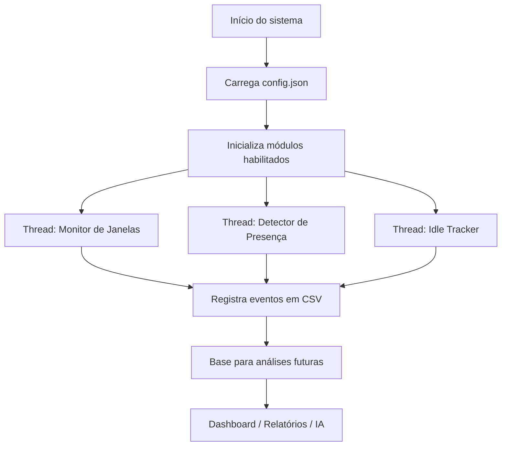

<p align="center">
  
</p>
 
<h1 align="center">WorkWatch</h1>
 
<p align="center">
  <strong>Sistema inteligente de monitoramento de produtividade desenvolvido em Python</strong>
</p>
 
<p align="center">
  
</p>
 
<p align="center">
  
  
  
  
  
</p>
 
---
 
## 📌 Visão Geral
 
O **WorkWatch** é um sistema inteligente de monitoramento de produtividade criado em **Python**, com foco em acompanhar atividades realizadas no computador de forma contínua, estruturada e extensível.
 
O projeto registra eventos importantes do ambiente de trabalho, como **janela ativa**, **programa em uso**, **presença via webcam**, **tempo de inatividade** e **logs consolidados em CSV**. A proposta é construir uma base técnica robusta para evoluir futuramente para dashboards, relatórios corporativos, análises de produtividade e integração com inteligência artificial.
 
> Projeto desenvolvido para estudo, uso pessoal, construção de portfólio e evolução prática em arquitetura de software, automação, análise de dados e monitoramento local.
 
---
 
## 🎯 Objetivo do Projeto
 
O WorkWatch foi criado com o objetivo de responder uma pergunta simples, mas muito importante:
 
> **Como medir, registrar e analisar a produtividade real de uso do computador de forma organizada, leve e evolutiva?**
 
A partir dessa ideia, o sistema busca fornecer uma estrutura capaz de:
 
- Registrar atividades realizadas no computador.
- Identificar qual janela ou programa está em uso.
- Detectar presença física do usuário via webcam.
- Identificar períodos de inatividade por teclado e mouse.
- Consolidar eventos em logs estruturados.
- Servir como base para relatórios, dashboards e análises futuras.
- Evoluir para um modelo corporativo com responsabilidade, transparência e conformidade com a LGPD.
 
---
 
## 🚀 Status Atual
 
| Área | Status | Descrição |
|---|---:|---|
| Monitoramento de janelas | ✅ Concluído | Captura janela ativa, programa executável e mudanças de foco. |
| Detector de presença | ✅ Concluído | Detecta presença física por webcam usando OpenCV + cvzone/MediaPipe. |
| Idle Tracker | ✅ Concluído | Identifica inatividade usando API nativa do Windows. |
| Logs em CSV | ✅ Concluído | Registra eventos consolidados em `storage/logs.csv`. |
| Configuração via JSON | ✅ Concluído | Permite ativar/desativar módulos e ajustar intervalos. |
| Arquitetura multi-thread | ✅ Concluído | Cada monitor roda em thread separada, sem travar a aplicação. |
| Dashboard local | 🧩 Planejado | Visualização gráfica dos dados coletados. |
| Classificação de produtividade | 🧩 Planejado | Classificação de apps e sites como produtivos, neutros ou distrativos. |
| Relatórios automáticos | 🧩 Planejado | Exportação futura em PDF, PNG ou dashboard. |
| Integração com IA | 🧩 Planejado | Análise inteligente de padrões de comportamento e produtividade. |
 
---
 
## 🧠 Principais Funcionalidades
 
### 🪟 1. Monitoramento de Janelas
 
O sistema acompanha a janela ativa no computador e registra alterações relevantes de uso.
 
**O que ele identifica:**
 
- Título da janela ativa.
- Programa executável em uso.
- Data e hora do evento.
- Mudança real de janela, evitando registros repetidos desnecessários.
 
**Exemplo de uso prático:**
 
- Saber quanto tempo o usuário ficou alternando entre VS Code, navegador, terminal, documentos ou outros programas.
- Criar base futura para classificar atividades como produtivas, neutras ou distrativas.
 
---
 
### 🎥 2. Detector de Presença via Webcam
 
O detector de presença utiliza webcam para identificar se o usuário está fisicamente presente diante do computador.
 
**Recursos atuais:**
 
- Captura de imagem via OpenCV.
- Detecção facial usando cvzone/MediaPipe.
- Registro de mudança de estado: `PRESENTE` ou `AUSENTE`.
- Execução isolada em thread separada.
- Liberação segura da webcam ao encerrar o sistema.
 
**Importante:** o objetivo não é gravar o usuário, mas detectar presença como evento técnico para análise de engajamento e uso do computador.
 
---
 
### ⏱️ 3. Idle Tracker
 
O Idle Tracker detecta quando o usuário fica sem interagir com teclado ou mouse por determinado período.
 
**Como funciona:**
 
- Usa a API nativa do Windows `GetLastInputInfo`.
- Mede o tempo desde a última interação.
- Registra quando o usuário entra em estado `INATIVO`.
- Registra quando o usuário retorna para estado `ATIVO`.
 
**Benefício:** permite diferenciar tempo real de uso do computador de períodos em que a máquina ficou parada.
 
---
 
### 🧾 4. Logs Consolidados em CSV
 
Todos os eventos importantes são registrados em um arquivo CSV, facilitando futuras análises com Python, Excel, Power BI ou dashboards.
 
Arquivo principal:
 
```text
storage/logs.csv
```
 
Exemplo simplificado de evento:
 
```csv
data,hora,modulo,evento,detalhe
16/05/2026,14:25:31,window_tracker,JANELA_ATIVA,code.exe - main.py
16/05/2026,14:28:10,presence_detector,PRESENTE,rosto detectado
16/05/2026,14:35:42,idle_tracker,INATIVO,sem interação por 60 segundos
```
 
---
 
### ⚙️ 5. Sistema de Configuração
 
O WorkWatch possui configuração externa em JSON, permitindo alterar o comportamento dos módulos sem mexer diretamente no código.
 
Exemplo de `config.json`:
 
```json
{
  "window_tracker": {
    "enabled": true,
    "interval_seconds": 5
  },
  "presence_detector": {
    "enabled": true,
    "interval_seconds": 10
  },
  "idle_tracker": {
    "enabled": true,
    "interval_seconds": 5
  },
  "logging": {
    "file_path": "storage/logs.csv"
  }
}
```
 
---
 
### 🧵 6. Arquitetura Multi-Thread
 
Cada módulo de monitoramento roda em sua própria thread, permitindo execução paralela e evitando travamentos.
 
**Vantagens dessa abordagem:**
 
- O monitoramento de janelas não trava a webcam.
- A webcam não impede o Idle Tracker de funcionar.
- O encerramento do sistema fica mais controlado.
- A aplicação se torna mais preparada para crescer em módulos independentes.
 
Ao pressionar `CTRL + C`, o sistema realiza um encerramento limpo:
 
- Sinaliza parada para as threads.
- Finaliza os monitores com segurança.
- Libera a webcam.
- Evita erros de interrupção mal tratados.
 
---
 
## 🏗️ Arquitetura do Projeto
 
O WorkWatch foi pensado de forma modular. Cada pasta tem uma responsabilidade clara, facilitando manutenção, evolução e leitura por outros desenvolvedores.
 
```text
WorkWatch/
│
├── main.py                       # Orquestrador principal das threads e do shutdown limpo
│
├── config.json                   # Configurações gerais do sistema
│
├── monitor/
│   ├── window_tracker.py         # Monitoramento da janela ativa
│   ├── presence_detector.py      # Detecção de presença via webcam
│   ├── idle_tracker.py           # Detecção de inatividade por teclado/mouse
│   └── multitask_analyzer.py     # Planejado: análise de troca rápida de janelas
│
├── storage/
│   └── logs.csv                  # Arquivo consolidado de eventos
│
├── analyzer/
│   └── content_classifier.py     # Planejado: classificação de produtividade
│
├── reports/
│   └── report_generator.py       # Planejado: geração de relatórios
│
├── dashboard/
│   └── app.py                    # Planejado: dashboard local
│
└── utils/
    ├── config.py                 # Planejado: utilitário de configuração
    └── logger.py                 # Planejado: utilitário centralizado de logs
```
 
---
 
## 🔄 Fluxo de Funcionamento
 

 
> Observação: o diagrama acima usa Mermaid, que é renderizado automaticamente pelo GitHub em arquivos Markdown compatíveis.
 
---
 
## 🛠️ Tecnologias Utilizadas
 
| Tecnologia | Uso no Projeto |
|---|---|
| Python 3.10 | Linguagem principal do sistema. |
| pygetwindow | Captura da janela ativa. |
| psutil | Identificação de processos e programas em execução. |
| pywin32 | Acesso a recursos do Windows, PID e handle da janela. |
| OpenCV | Captura de imagem via webcam. |
| cvzone / MediaPipe | Detecção facial para presença. |
| ctypes | Acesso à API nativa do Windows para inatividade. |
| threading | Execução paralela dos módulos de monitoramento. |
| json | Configuração externa do sistema. |
| csv | Registro estruturado de eventos. |
| datetime | Registro de data e hora dos eventos. |
 
---
 
## 💻 Como Executar o Projeto
 
### 1. Clone o repositório
 
```bash
git clone https://github.com/Dinox75/WorkWatch.git
cd WorkWatch
```
 
### 2. Crie e ative um ambiente virtual
 
No Windows:
 
```bash
python -m venv venv
venv\Scripts\activate
```
 
### 3. Instale as dependências principais
 
Caso o projeto ainda não tenha um `requirements.txt`, instale manualmente as bibliotecas utilizadas:
 
```bash
pip install pygetwindow psutil pywin32 opencv-python cvzone
```
 
> Dependendo do ambiente, o `cvzone` pode exigir dependências adicionais relacionadas ao MediaPipe.
 
### 4. Execute o sistema
 
```bash
python main.py
```
 
---
 
## 🧪 Requisitos e Observações Técnicas
 
- Projeto recomendado para ambiente Windows.
- O Idle Tracker usa API nativa do Windows.
- O detector de presença precisa de webcam disponível.
- A webcam deve ser liberada corretamente no encerramento.
- Em alguns ambientes, bibliotecas como OpenCV, MediaPipe e pywin32 podem exigir ajustes de instalação.
- O projeto está em desenvolvimento e pode passar por mudanças estruturais.
 
---
 
## 📊 Possibilidades de Análise Futuras
 
Com os dados registrados em CSV, o WorkWatch poderá evoluir para análises como:
 
- Tempo total ativo por dia.
- Tempo total inativo por período.
- Aplicações mais utilizadas.
- Frequência de troca de janelas.
- Padrões de multitarefa.
- Picos de produtividade.
- Horários de maior distração.
- Classificação de programas por categoria.
- Relatórios semanais ou mensais.
 
---
 
## 🧩 Roadmap
 
### Curto Prazo
 
- [ ] Melhorar o sistema centralizado de logs.
- [ ] Criar `requirements.txt`.
- [ ] Padronizar estrutura final dos eventos CSV.
- [ ] Criar camada de configuração em `utils/config.py`.
- [ ] Criar logger reutilizável em `utils/logger.py`.
 
### Médio Prazo
 
- [ ] Implementar detector de multitarefa.
- [ ] Criar classificador de programas produtivos, neutros e distrativos.
- [ ] Gerar relatórios simples por dia.
- [ ] Criar dashboard local com Flask ou Streamlit.
- [ ] Adicionar gráficos de atividade.
 
### Longo Prazo
 
- [ ] Integrar análise com IA.
- [ ] Gerar relatórios automáticos em PDF.
- [ ] Criar alertas inteligentes.
- [ ] Implementar painel corporativo.
- [ ] Criar política de permissões e auditoria.
- [ ] Evoluir para uma solução profissional de produtividade e gestão de atividade.
 
---
 
## 🔐 Segurança, Privacidade e LGPD
 
O WorkWatch é um projeto de estudo e uso local. Apesar de lidar com monitoramento de atividade, seu uso deve sempre respeitar privacidade, transparência e legislação aplicável.
 
Para qualquer aplicação em ambiente corporativo real, é necessário considerar:
 
- Consentimento claro dos colaboradores.
- Política interna de monitoramento.
- Finalidade legítima e bem documentada.
- Transparência sobre quais dados são coletados.
- Segurança no armazenamento dos logs.
- Controle de acesso às informações.
- Conformidade com a LGPD.
- Auditoria e responsabilidade sobre o uso dos dados.
 
> Monitoramento de produtividade deve ser usado para melhorar processos, apoiar gestão e entender padrões de trabalho, nunca para vigilância abusiva ou invasiva.
 
---
 
## 📚 Aprendizados Aplicados
 
Este projeto reúne vários conceitos importantes para desenvolvimento Python e construção de sistemas reais:
 
- Organização modular de projeto.
- Manipulação de arquivos CSV e JSON.
- Monitoramento de processos do sistema operacional.
- Uso de webcam com OpenCV.
- Detecção facial com bibliotecas externas.
- Threads e execução paralela.
- Tratamento de encerramento com segurança.
- Separação de responsabilidades por módulos.
- Preparação de base de dados para análise futura.
- Pensamento de produto com visão de expansão.
 
---
 
## 👨‍💻 Autor
 
**Vinicius Lima**
 
Estudante de **Análise de Dados e Desenvolvimento de Sistemas**, em evolução prática com Python, análise de dados, automação, Power BI, desenvolvimento de projetos para portfólio e soluções com visão profissional.
 
<p align="left">
  <a href="https://github.com/Dinox75">
    
  </a>
  <a href="https://www.linkedin.com/in/vinicius-limajr/">
    
  </a>
  <a href="mailto:vibylima75@gmail.com">
    
  </a>
</p>
 
- GitHub: `https://github.com/Dinox75`
- LinkedIn: `https://www.linkedin.com/in/vinicius-limajr/`
- E-mail: `vibylima75@gmail.com`
- TikTok: `https://www.tiktok.com/@dinox_xv`
 
---
 
## 📄 Licença
 
Consulte o arquivo `LICENSE` deste repositório para mais informações.
 
---
 
## 📅 Última Atualização
 
**16/05/2026**
 
---
 
<p align="center">
  Desenvolvido por <strong>Vinicius Lima</strong> • Python • Monitoramento • Produtividade • Portfólio
</p>
