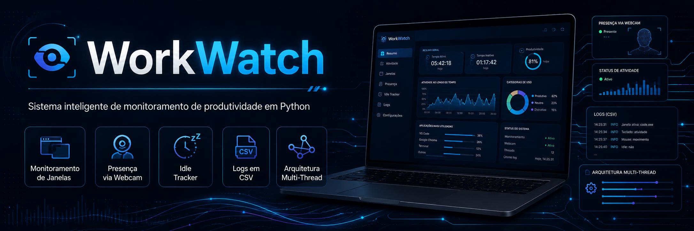
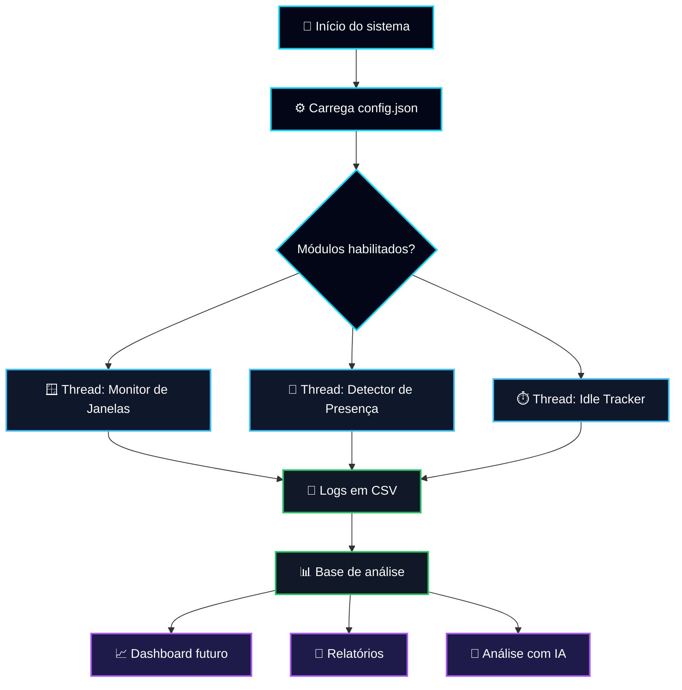
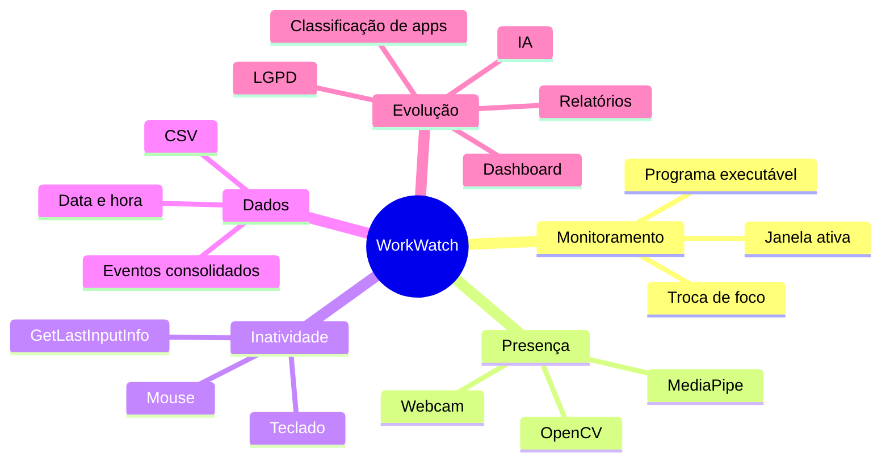

<p align="center">
  
</p>
 
<p align="center">
  
</p>
 
<h1 align="center">⚡ WorkWatch</h1>
 
<p align="center">
  <strong>Sistema inteligente de monitoramento de produtividade em Python</strong><br>
  <sub>Monitoramento local, logs estruturados, presença via webcam, idle tracker e arquitetura preparada para evolução corporativa.</sub>
</p>
 
<p align="center">
  
</p>
 
<p align="center">
  
  
  
  
  
  
</p>
 
<p align="center">
  <a href="#-visão-geral"></a>
  <a href="#-funcionalidades"></a>
  <a href="#-arquitetura"></a>
  <a href="#-como-executar"></a>
  <a href="#-roadmap"></a>
  <a href="#-autor"></a>
</p>
 
---
 
## 🌌 Visão Geral
 
O **WorkWatch** é um sistema inteligente de monitoramento de produtividade desenvolvido em **Python**, criado para acompanhar atividades realizadas no computador de forma contínua, estruturada e expansível.
 
A proposta do projeto é registrar eventos importantes do ambiente de trabalho, como **janela ativa**, **programa em uso**, **presença física via webcam**, **tempo de inatividade** e **logs consolidados em CSV**. Esses dados formam uma base técnica para futuras análises, dashboards, relatórios corporativos e integração com inteligência artificial.
 
> O projeto nasceu como estudo prático e portfólio, mas foi estruturado com visão de produto: modular, extensível, documentado e preparado para evoluir para um cenário profissional.
 
---
 
## 🎯 Objetivo do Projeto
 
O WorkWatch responde a uma pergunta central:
 
> **Como medir, registrar e analisar a produtividade real de uso do computador de forma organizada, leve e evolutiva?**
 
A partir dessa ideia, o sistema busca entregar uma base sólida para:
 
<table>
  <tr>
    <td width="50%">
      <h3>📡 Monitoramento Local</h3>
      <p>Capturar janelas, programas, presença e inatividade sem depender de serviços externos.</p>
    </td>
    <td width="50%">
      <h3>📊 Dados para Análise</h3>
      <p>Gerar logs estruturados para análise futura em Python, Excel, Power BI, dashboards ou IA.</p>
    </td>
  </tr>
  <tr>
    <td width="50%">
      <h3>🧩 Arquitetura Modular</h3>
      <p>Separar responsabilidades em módulos independentes, facilitando manutenção e evolução.</p>
    </td>
    <td width="50%">
      <h3>🏢 Visão Corporativa</h3>
      <p>Criar uma base técnica que possa evoluir para relatórios, gestão, auditoria e conformidade com LGPD.</p>
    </td>
  </tr>
</table>
 
---
 
## 🧭 Status Executivo
 
| Pilar | Status | Nível Atual | Descrição |
|---|---:|---|---|
| Monitoramento de janelas | ✅ | MVP funcional | Captura janela ativa, programa executável e mudanças de foco. |
| Detector de presença | ✅ | MVP funcional | Detecta presença via webcam com OpenCV + cvzone/MediaPipe. |
| Idle Tracker | ✅ | MVP funcional | Identifica inatividade usando API nativa do Windows. |
| Logs em CSV | ✅ | Funcional | Registra eventos consolidados em `storage/logs.csv`. |
| Configuração via JSON | ✅ | Funcional | Permite ativar/desativar módulos e ajustar intervalos. |
| Arquitetura multi-thread | ✅ | Funcional | Cada monitor roda em thread separada, sem travar a aplicação. |
| Dashboard local | 🧩 | Planejado | Visualização gráfica dos dados coletados. |
| Classificação de produtividade | 🧩 | Planejado | Classificação de apps e sites como produtivos, neutros ou distrativos. |
| Relatórios automáticos | 🧩 | Planejado | Exportação futura em PDF, PNG ou painel web. |
| Integração com IA | 🧩 | Planejado | Análise inteligente de padrões de comportamento e produtividade. |
 
---
 
## ⚙️ Funcionalidades
 
### 🪟 1. Monitoramento de Janelas
 
O módulo de janelas acompanha a aplicação ativa no computador e registra mudanças relevantes de foco.
 
**O que ele identifica:**
 
- Título da janela ativa.
- Programa executável em uso.
- Data e hora do evento.
- Mudança real de janela, evitando registros repetidos desnecessários.
 
**Exemplo de uso prático:**
 
- Identificar quanto tempo o usuário alternou entre VS Code, navegador, terminal, documentos e outros programas.
- Criar base para classificar atividades como produtivas, neutras ou distrativas.
 
---
 
### 🎥 2. Detector de Presença via Webcam
 
O detector de presença usa webcam para identificar se o usuário está fisicamente presente diante do computador.
 
**Recursos atuais:**
 
- Captura de imagem via OpenCV.
- Detecção facial usando cvzone/MediaPipe.
- Registro de mudança de estado: `PRESENTE` ou `AUSENTE`.
- Execução isolada em thread separada.
- Liberação segura da webcam ao encerrar o sistema.
 
> O objetivo não é gravar ou vigiar o usuário. A webcam é usada como sensor técnico de presença, registrando apenas eventos relevantes para análise de engajamento e uso do computador.
 
---
 
### ⏱️ 3. Idle Tracker
 
O Idle Tracker detecta quando o usuário fica sem interagir com teclado ou mouse por determinado período.
 
**Como funciona:**
 
- Usa a API nativa do Windows `GetLastInputInfo`.
- Mede o tempo desde a última interação.
- Registra quando o usuário entra em estado `INATIVO`.
- Registra quando o usuário retorna para estado `ATIVO`.
 
**Benefício:** permite diferenciar tempo real de uso do computador de períodos em que a máquina ficou parada.
 
---
 
### 🧾 4. Logs Consolidados em CSV
 
Todos os eventos importantes são registrados em um arquivo CSV, facilitando análise futura com Python, Excel, Power BI ou dashboards.
 
Arquivo principal:
 
```text
storage/logs.csv
```
 
Exemplo simplificado de evento:
 
```csv
data,hora,modulo,evento,detalhe
16/05/2026,14:25:31,window_tracker,JANELA_ATIVA,code.exe - main.py
16/05/2026,14:28:10,presence_detector,PRESENTE,rosto detectado
16/05/2026,14:35:42,idle_tracker,INATIVO,sem interação por 60 segundos
```
 
---
 
### 🧵 5. Arquitetura Multi-Thread
 
Cada módulo de monitoramento roda em sua própria thread, permitindo execução paralela e evitando travamentos.
 
**Vantagens:**
 
- O monitoramento de janelas não trava a webcam.
- A webcam não impede o Idle Tracker de funcionar.
- O encerramento do sistema fica mais controlado.
- A aplicação se torna preparada para crescer com módulos independentes.
 
Ao pressionar `CTRL + C`, o sistema realiza um encerramento limpo:
 
- Sinaliza parada para as threads.
- Finaliza os monitores com segurança.
- Libera a webcam.
- Evita erros de interrupção mal tratados.
 
---
 
## 🏗️ Arquitetura
 
O WorkWatch foi pensado com separação de responsabilidades. Cada pasta possui uma função clara, facilitando manutenção, leitura e evolução.
 
```text
WorkWatch/
│
├── README.md                     # Documentação principal do projeto
├── assets/
│   └── banner_Work.png           # Banner visual do README
│
├── main.py                       # Orquestrador principal das threads e do shutdown limpo
│
├── config.json                   # Configurações gerais do sistema
│
├── monitor/
│   ├── window_tracker.py         # Monitoramento da janela ativa
│   ├── presence_detector.py      # Detecção de presença via webcam
│   ├── idle_tracker.py           # Detecção de inatividade por teclado/mouse
│   └── multitask_analyzer.py     # Planejado: análise de troca rápida de janelas
│
├── storage/
│   └── logs.csv                  # Arquivo consolidado de eventos
│
├── analyzer/
│   └── content_classifier.py     # Planejado: classificação de produtividade
│
├── reports/
│   └── report_generator.py       # Planejado: geração de relatórios
│
├── dashboard/
│   └── app.py                    # Planejado: dashboard local
│
└── utils/
    ├── config.py                 # Planejado: utilitário de configuração
    └── logger.py                 # Planejado: utilitário centralizado de logs
```
 
---
 
## 🔄 Fluxo de Funcionamento
 

 
---
 
## 🧠 Visão Técnica do Produto
 

 
---
 
## 🛠️ Tecnologias Utilizadas
 
| Tecnologia | Uso no Projeto |
|---|---|
| Python 3.10 | Linguagem principal do sistema. |
| pygetwindow | Captura da janela ativa. |
| psutil | Identificação de processos e programas em execução. |
| pywin32 | Acesso a recursos do Windows, PID e handle da janela. |
| OpenCV | Captura de imagem via webcam. |
| cvzone / MediaPipe | Detecção facial para presença. |
| ctypes | Acesso à API nativa do Windows para inatividade. |
| threading | Execução paralela dos módulos de monitoramento. |
| json | Configuração externa do sistema. |
| csv | Registro estruturado de eventos. |
| datetime | Registro de data e hora dos eventos. |
 
<p align="center">
  
  
  
  
  
</p>
 
---
 
## 💻 Como Executar
 
### 1. Clone o repositório
 
```bash
git clone https://github.com/Dinox75/WorkWatch.git
cd WorkWatch
```
 
### 2. Crie e ative um ambiente virtual
 
No Windows:
 
```bash
python -m venv venv
venv\Scripts\activate
```
 
### 3. Instale as dependências principais
 
Caso o projeto ainda não tenha um `requirements.txt`, instale manualmente as bibliotecas utilizadas:
 
```bash
pip install pygetwindow psutil pywin32 opencv-python cvzone
```
 
> Dependendo do ambiente, o `cvzone` pode exigir dependências adicionais relacionadas ao MediaPipe.
 
### 4. Execute o sistema
 
```bash
python main.py
```
 
---
 
## 🧪 Requisitos e Observações Técnicas
 
- Projeto recomendado para ambiente Windows.
- O Idle Tracker usa API nativa do Windows.
- O detector de presença precisa de webcam disponível.
- A webcam deve ser liberada corretamente no encerramento.
- Bibliotecas como OpenCV, MediaPipe e pywin32 podem exigir ajustes de instalação dependendo do ambiente.
- O projeto está em desenvolvimento e pode passar por mudanças estruturais.
 
---
 
## 📊 Possibilidades de Análise Futuras
 
Com os dados registrados em CSV, o WorkWatch poderá evoluir para análises como:
 
<table>
  <tr>
    <td width="33%">
      <h3>📈 Produtividade</h3>
      <ul>
        <li>Tempo total ativo por dia</li>
        <li>Tempo inativo por período</li>
        <li>Picos de produtividade</li>
      </ul>
    </td>
    <td width="33%">
      <h3>🧭 Comportamento</h3>
      <ul>
        <li>Frequência de troca de janelas</li>
        <li>Padrões de multitarefa</li>
        <li>Horários de distração</li>
      </ul>
    </td>
    <td width="33%">
      <h3>🏢 Gestão</h3>
      <ul>
        <li>Relatórios semanais</li>
        <li>Classificação de programas</li>
        <li>Indicadores por categoria</li>
      </ul>
    </td>
  </tr>
</table>
 
---
 
## 🧩 Roadmap
 
### 🔵 Curto Prazo
 
- [ ] Melhorar o sistema centralizado de logs.
- [ ] Criar `requirements.txt`.
- [ ] Padronizar estrutura final dos eventos CSV.
- [ ] Criar camada de configuração em `utils/config.py`.
- [ ] Criar logger reutilizável em `utils/logger.py`.
 
### 🟣 Médio Prazo
 
- [ ] Implementar detector de multitarefa.
- [ ] Criar classificador de programas produtivos, neutros e distrativos.
- [ ] Gerar relatórios simples por dia.
- [ ] Criar dashboard local com Flask ou Streamlit.
- [ ] Adicionar gráficos de atividade.
 
### 🟢 Longo Prazo
 
- [ ] Integrar análise com IA.
- [ ] Gerar relatórios automáticos em PDF.
- [ ] Criar alertas inteligentes.
- [ ] Implementar painel corporativo.
- [ ] Criar política de permissões e auditoria.
- [ ] Evoluir para uma solução profissional de produtividade e gestão de atividade.
 
---
 
## 🔐 Segurança, Privacidade e LGPD
 
O WorkWatch é um projeto de estudo e uso local. Apesar de lidar com monitoramento de atividade, seu uso deve sempre respeitar privacidade, transparência e legislação aplicável.
 
Para qualquer aplicação em ambiente corporativo real, é necessário considerar:
 
- Consentimento claro dos colaboradores.
- Política interna de monitoramento.
- Finalidade legítima e bem documentada.
- Transparência sobre quais dados são coletados.
- Segurança no armazenamento dos logs.
- Controle de acesso às informações.
- Conformidade com a LGPD.
- Auditoria e responsabilidade sobre o uso dos dados.
 
> Monitoramento de produtividade deve ser usado para melhorar processos, apoiar gestão e entender padrões de trabalho, nunca para vigilância abusiva ou invasiva.
 
---
 
## 📚 Aprendizados Aplicados
 
Este projeto reúne conceitos importantes para desenvolvimento Python e construção de sistemas reais:
 
- Organização modular de projeto.
- Manipulação de arquivos CSV e JSON.
- Monitoramento de processos do sistema operacional.
- Uso de webcam com OpenCV.
- Detecção facial com bibliotecas externas.
- Threads e execução paralela.
- Tratamento de encerramento com segurança.
- Separação de responsabilidades por módulos.
- Preparação de base de dados para análise futura.
- Pensamento de produto com visão de expansão.
 
---
 
## 🧑‍💻 Autor
 
**Vinicius Lima**
 
Estudante de **Análise de Dados e Desenvolvimento de Sistemas**, em evolução prática com Python, análise de dados, automação, Power BI, desenvolvimento de projetos para portfólio e soluções com visão profissional.
 
<p align="left">
  <a href="https://github.com/Dinox75">
    
  </a>
  <a href="https://www.linkedin.com/in/vinicius-limajr/">
    
  </a>
  <a href="mailto:vibylima75@gmail.com">
    
  </a>
  <a href="https://www.tiktok.com/@dinox_xv">
    
  </a>
</p>
 
- GitHub: `https://github.com/Dinox75`
- LinkedIn: `https://www.linkedin.com/in/vinicius-limajr/`
- E-mail: `vibylima75@gmail.com`
- TikTok: `https://www.tiktok.com/@dinox_xv`
 
---
 
## 📄 Licença
 
Consulte o arquivo `LICENSE` deste repositório para mais informações.
 
---
 
## 📅 Última Atualização
 
**16/05/2026**
 
---
 
<p align="center">
  
</p>
 
<p align="center">
  Desenvolvido por <strong>Vinicius Lima</strong> • Python • Monitoramento • Produtividade • Dados • Portfólio
</p>
